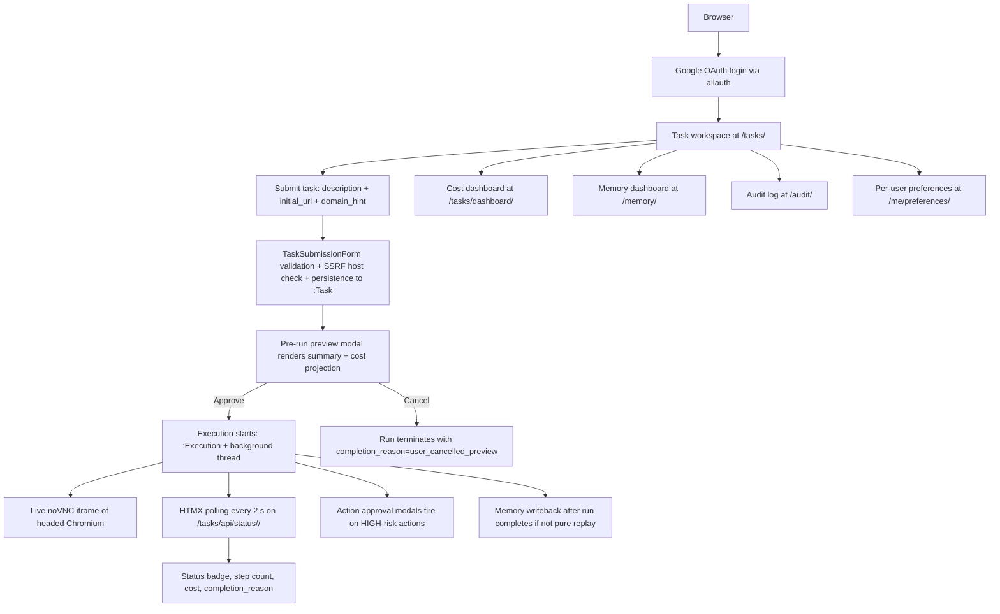
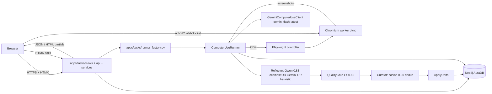

# CUTIEE Part 1: Product Refinement and System Scope

**INFO490 Final Project (A10), Spring 2026.** Author: Edward Hu (`Edward-H26`). Repository: `https://github.com/Edward-H26/CUTIEE`. Production deployment: `https://cutiee-1kqk.onrender.com`.

This is the standalone Part 1 write-up per the rubric's "1-2 pages max" requirement. The verbose technical report at `docs/TECHNICAL-REPORT.md` and the rubric-graded 4-6 page submission at `docs/REPORT.md` cover the four implementation parts.

## 1. Refined Problem Statement

Cohort-scale browser automation platforms typically pick one of two unsatisfying corners. Either they lean on hosted LLM APIs end-to-end and pay for every step, or they rely on scripted recipes and lose generality. CUTIEE's thesis is that those corners are not the only options. A hybrid system with explicit memory, replay, and per-tier routing keeps the generality of LLM-driven action selection while paying the LLM only for genuinely novel decisions. The remaining decisions either replay from cached procedural templates at zero variable cost or run through cheaper local models that match large-frontier accuracy on narrow sub-tasks like reflection and decomposition. The system targets 30 to 50 concurrent users with one active task per user, deployed on a single Render Blueprint plus a managed Neo4j AuraDB Free tier.

The cost case for the hybrid path is the design's load-bearing argument. The numbers are derived from `scripts/benchmark_costs.py`, the public Gemini Flash and Anthropic Computer Use list prices on 2026-04-29, and the `data/benchmarks/cost_waterfall.csv` artifact. The full derivation lives in `docs/REPORT.md` Section 1.1 and `README_AI.md`. The crossover sits below approximately 10 paid task runs per day per Render dyno, where fixed hosting cost dominates and the API-only path is simpler. Above approximately 100 paid runs per day the variable savings overcome fixed cost and CUTIEE pulls ahead linearly. CUTIEE chose the hybrid path because the action-layer cost wallet is the only abuse-prevention primitive that survives a pathological prompt, and because procedural replay collapses recurring-task cost to zero, which is structurally unavailable to a stateless API client.

## 2. Target Users

The primary user is an INFO490 classmate running their own browser workflows during the cohort demo session. Each classmate has one active task at a time, an authenticated Google identity, and a shared cohort budget enforced through CUTIEE's per-user cost ledger. The secondary user is the course evaluator who needs to inspect the cost dashboard, the audit log, and the memory store to verify the rubric claims. Both users hit the same dashboard. CUTIEE has no admin-only features beyond the standard `/admin/` Django panel.

## 3. Final Feature Set

**Shipping in this submission:**

- Google OAuth login through django-allauth, plus optional email-and-password fallback.
- Task submission form with risk classification, SSRF host validation, and pre-run preview approval.
- Live browser progress in a noVNC iframe inside the Tasks detail page.
- HTMX-driven status polling every 2 seconds and approval modals for high-risk actions.
- ACE memory pipeline (Reflect, QualityGate at 0.60, Curator with 0.90 cosine dedup, Apply) with three-channel decay (semantic 0.01, episodic 0.05, procedural 0.005).
- Procedural memory replay at zero inference cost, fragment-level replay with confidence threshold (`CUTIEE_REPLAY_FRAGMENT_CONFIDENCE=0.80`).
- Per-task, per-hour, and per-day USD cost wallet enforced via Neo4j `:CostLedger` MERGE.
- Audit trail with per-step `:Screenshot` (3-day TTL) and `:AuditEntry` records carrying action, target, model, tier, cost, risk, and approval status.
- Cost dashboard with Chart.js timeseries (live-redrawn every 30 s), tier doughnut, and CSV export.
- Memory dashboard with the bullet store grouped by type and topic, plus JSON export.
- Two interchangeable CU backends (`gemini` default at `gemini-flash-latest`, `browser_use` opt-in over `gemini-3-flash-preview`).
- Local `Qwen/Qwen3.5-0.8B` for memory-side reflection and decomposition on localhost tasks (HuggingFace transformers, MIRA pattern), with a three-tier fallback chain (Qwen, Gemini, heuristic).
- Production hardening: HSTS, secure cookies, X-Frame-Options=DENY, SECURE_SSL_REDIRECT (gated on production).
- Optional structured JSON logging via `LOGGING_FORMAT=json`, optional Sentry behind `SENTRY_DSN`, optional Prometheus exporter at `/metrics/` behind `CUTIEE_ENABLE_PROMETHEUS=1`.
- FastEmbed `BAAI/bge-small-en-v1.5` dense embeddings auto-activate in production for procedural-replay match recall.

**Removed or deprioritized:**

- Multi-tier router with `AdaptiveRouter` and DOM-based clients (deprecated 2026-04 once Gemini Flash gained the Computer Use tool at flash pricing).
- Anthropic Computer Use backend (out of scope per the project's framework constraint; the alternate backend is browser-use over Gemini 3 Flash only).
- llama-server / Qwen sidecar (replaced by in-process HuggingFace transformers).
- Multi-user-task concurrency (single concurrent task per user invariant; SPEC.md invariant 7).
- GitHub Actions CI (verification stays manual via `uv run` per the project policy).
- Production rate-limit middleware (replaced by cost-aware blast-radius caps; see Technical Report Section 5.5).

## 4. User Flow

## 5. Updated Design (System Flow Diagram)

## Evolution from the initial proposal

The initial proposal scoped CUTIEE as a multi-tier router that would split each agent step across three model tiers based on action complexity. Pre-implementation prototyping showed that Gemini Flash with the Computer Use tool already wins on cost and accuracy, and the multi-tier router added complexity without measurable benefit. The router was removed in favor of a single CU model plus a procedural-replay tier (zero cost) plus a local Qwen reflector for memory-side LLM work. The mid-point presentation feedback further pushed CUTIEE toward concrete cost evidence (the cost waterfall at `data/benchmarks/cost_waterfall.csv`) and toward shipping a working preview-and-approval flow rather than merely describing it. Both refinements are now in production at `https://cutiee-1kqk.onrender.com`.

The cost evidence that drove that pivot is summarized here so Part 1 stays self-contained, even if a grader reads only this document:

| Metric | API-only baseline (Anthropic CU) | CUTIEE | Ratio |
|---|---|---|---|
| Per-task cost (15-step novel) | $0.194 | $0.0046 to $0.00954 | 21x to 42x cheaper |
| Per-task cost (recurring with replay) | $0.194 | $0 | replay collapses marginal cost to zero |
| Cohort cost (50 users, 5 tasks per user per day) | ~$1,505 / month | ~$71 / month | 21x cheaper |
| 10K-DAU projection (50K runs/day, 60% replay) | ~$375,000 / month | ~$8,100 / month | 46x cheaper |
| End-to-end task latency (15 steps, full replay) | ~52 s | ~3 s | 17x faster |
| Solving rate uplift over the no-memory baseline | n/a | +17.9 percent overall, +71.4 percent procedural | LongTermMemoryBased-ACE v5 source |
| Test coverage | n/a | 226 fast tests passing | `uv run pytest -m "not slow and not local and not production and not integration"` |
