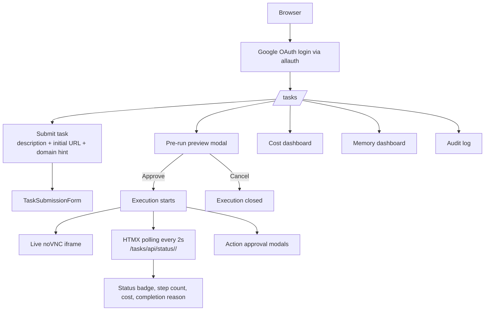
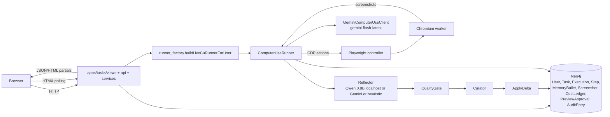

# CUTIEE Technical Report

**Computer Use agentIc-framework with Token-efficient harnEss Engineering**

INFO490 Final Project (A10), Spring 2026.

---

## 1. Product Overview

### Refined Problem Statement

Cohort-scale browser automation platforms either (a) burn budget on every step because
they lean on hosted LLM APIs end-to-end, or (b) limit themselves to scripted recipes
and lose generality. CUTIEE solves the middle: a Django web app that wraps a single
computer-use agent with three cost-reduction mechanisms (procedural memory replay,
temporal recency pruning, multi-tier model routing) and a self-evolving memory
subsystem (ACE: Reflect → QualityGate → Curator → Apply). Recurring tasks drop to
zero VLM cost. Novel tasks compose tiers so the expensive frontier model only fires
for the hardest five percent of decisions.

### Target Users

INFO490 classmates running their own task workflows during demos. The system is sized
for a few dozen concurrent users with one active task per user, and provisioned on a
single Render Blueprint (web service plus Docker worker plus Neo4j AuraDB Free).

### Final Feature Set

**Kept (shipping in this submission):**

- Google OAuth login via django-allauth
- Task submission form with risk classification and pre-run preview
- Live browser progress in a noVNC iframe inside the dashboard
- HTMX-based status polling and approval modals
- ACE memory pipeline (Reflect → QualityGate → Curator → Apply) with three-channel
  decay (semantic 0.01, episodic 0.05, procedural 0.01)
- Procedural memory replay at zero inference cost
- Per-task / per-hour / per-day cost wallet enforced via Neo4j `:CostLedger`
- Audit trail with per-step screenshots (3-day TTL)
- Cost dashboard with Chart.js timeseries and tier distribution
- Memory dashboard with bullet store and procedural template export (JSON)
- Two interchangeable CU backends (`gemini` default, `browser_use` opt-in)
- Local `Qwen/Qwen3.5-0.8B` for memory-side reflection and decomposition on localhost
  tasks (HuggingFace transformers, MIRA pattern)

**Removed or deprioritized:**

- Multi-tier router with `AdaptiveRouter` / difficulty classifier / DOM-based clients
  (deprecated 2026-04 once Gemini Flash gained the ComputerUse tool at flash pricing)
- Anthropic Computer Use backend (out of scope per the project's framework constraint)
- llama-server / Qwen sidecar (replaced by in-process HuggingFace transformers)
- Multi-user-task concurrency (single concurrent task per user invariant)
- GitHub Actions CI (verification stays manual)
- Production rate-limit middleware (cohort scale plus daily cost cap is sufficient)

### User Flow

### System Flow Diagram

---

## 2. Django System Architecture

### Apps

| App | Purpose | Key files |
|---|---|---|
| `cutiee_site` | Project config | `settings.py`, `urls.py`, `neo4j_session_backend.py`, `_internal_db.py` |
| `accounts` | Google OAuth + Neo4j user sync | `signals.py:sync_user_to_neo4j` |
| `tasks` | Task submission, agent runner bridge, JSON API, HTMX | `views.py`, `api.py`, `services.py`, `runner_factory.py`, `repo.py`, `forms.py` |
| `memory_app` | ACE bullet dashboard, JSON export | `views.py`, `repo.py` |
| `audit` | Paginated audit log + Neo4j screenshot store | `views.py`, `repo.py`, `screenshot_store.py` |
| `landing` | Unauthenticated marketing page | `views.py` |
| `common` | Cross-app helpers (`safeInt`) | `query_utils.py` |

### Models

CUTIEE deliberately does NOT use Django ORM for domain entities. Every domain object
(User, Task, Execution, MemoryBullet, AuditEntry, Screenshot, CostLedger,
PreviewApproval) lives in Neo4j and is accessed via Cypher repos at `apps/*/repo.py`.
Django's in-memory SQLite holds only framework bookkeeping (auth, sessions,
contenttypes, sites, allauth provider tables).

This is an intentional architectural choice. Memory bullets carry per-channel decay
state, embedding vectors, and tag arrays; Cypher graph queries fit those access
patterns better than relational SQL. The `apps/accounts/signals.py` post-save signal
mirrors every Django ORM `User` into Neo4j as a `:User` node so OAuth identities are
joinable to domain data.

There is one deliberate ORM exception added for the Django-system-quality rubric:
`apps/accounts/models.py:UserPreference`. It is a small framework-side bookkeeping
model (`OneToOneField` to Django `User`) that stores UI preferences such as theme,
dashboard window, and whether audit screenshots should default to redaction. It does
not compete with Neo4j domain state; it demonstrates standard Django modeling while
keeping task/memory/audit entities in the graph where they belong.

### Views, URLs, Forms

24 function-based views across 5 apps. URL conventions follow Django's `app_name`
pattern; templates use both `` reverses and model-style links such as
`{{ task.get_absolute_url }}` from the `TaskRow` facade in `apps/tasks/repo.py`.
Single form: `apps/tasks/forms.py:11 TaskSubmissionForm` (description, initial_url,
domain_hint).

### Templates and Static

- `templates/base.html` provides the master layout with conditional auth-aware sidebar
  and HTMX + Chart.js + GSAP CDN includes
- Per-app templates extend `base.html`
- Allauth templates override defaults for Google OAuth and signup flows
- `static/css/cutiee.css` provides the design tokens (slate-blue palette inherited from
  the [Memoria design system](../CUTIEEDesignSystem/README.md))
- HTMX 1.9.10, Chart.js, Inter / Manrope fonts loaded via CDN

### Authentication

- django-allauth with Google OAuth (`apps/accounts`)
- 26 `@login_required` decorators across views and APIs
- `cutiee_site/neo4j_session_backend.py` provides a custom session engine backed by
  Neo4j `:Session` nodes, used in production
- Per-user `user_id IS NOT NULL` constraints on every domain node enforce per-user
  isolation; bullets are never shared across cohort users

### JSON APIs

20+ JSON endpoints under `/tasks/api/*` and `/memory/`:

| Endpoint | Purpose |
|---|---|
| `GET /tasks/api/status/<execution_id>/` | Polled by HTMX every 2s; returns step count, cost, completion reason |
| `GET /tasks/api/cost-summary/` | Aggregate spend, task count, replay step count |
| `GET /tasks/api/cost-timeseries/` | Daily spend over N days (default 14) for Chart.js |
| `GET /tasks/api/tier-distribution/` | Step counts by model tier for the doughnut chart |
| `GET /tasks/api/memory-stats/` | Bullet count, template count, average strength |
| `GET /tasks/api/audit/` | Paginated audit entries with offset / limit |
| `GET /tasks/api/screenshot/<execution_id>/<index>.png` | Per-step PNG with cache headers |
| `POST /tasks/<id>/run/` | Triggers the agent thread |
| `POST /tasks/api/approval/<execution_id>/<decision>/` | User decision for high-risk action gate |
| `POST /tasks/api/preview/<execution_id>/<decision>/` | User decision for pre-run preview gate |
| `GET /memory/export/` | Downloads memory bullets and templates as a JSON attachment |
| `GET /api/vlm-health/` | Status banner for the Computer Use model readiness |

### Production-Aware Setup

- `.env.example` is the canonical environment template (single source of truth)
- `.gitignore` excludes `.env`, `data/`, `*.gguf`, `.cache/huggingface-models/`,
  Playwright artifacts, and curated screenshots
- Settings split via `CUTIEE_ENV=local|production`; Render auto-detects via
  `RENDER_EXTERNAL_HOSTNAME`
- Production hardening (HSTS, secure cookies, X-Frame-Options=DENY, SSL redirect)
  gates on `CUTIEE_ENV=production`

---

## 3. AI Integration

### Where AI enters the user flow

The AI feature is the agent itself. It enters the application at four places, in
order:

1. `apps/tasks/services.runTaskForUser` (the Django bridge)
2. `apps/tasks/runner_factory.buildLiveCuRunnerForUser` (wires browser, memory, replay,
   screenshot sink)
3. `agent/harness/computer_use_loop.ComputerUseRunner.run` (the screenshot ↔ function
   call loop)
4. `agent/routing/models/gemini_cu.GeminiComputerUseClient.nextAction` (the model call)

### Pipeline (model usage by step)

| Step | Local or API | Model |
|---|---|---|
| Form parse | local | none |
| Risk classify | local | regex (word-boundary keywords) |
| Pre-run preview | local | rule-based template |
| Replay match | local | cosine over embeddings + threshold |
| Embedding | local | `BAAI/bge-small-en-v1.5` (FastEmbed) or SHA-256 hash |
| Browser-control loop | API | `gemini-flash-latest` (Computer Use tool) |
| Action execution | local | none (Playwright) |
| Reflector (lesson distillation) | hybrid | `Qwen/Qwen3.5-0.8B` (localhost), Gemini (otherwise), heuristic (fallback) |
| Decomposer (action graph) | hybrid | `Qwen/Qwen3.5-0.8B` (localhost), Gemini, empty graph (fallback) |
| QualityGate, Curator, Decay, Cost wallet | local | none |

### Why hybrid (justification for the rubric's "API wrapper" check)

CUTIEE qualifies as a hybrid system per the rubric's Option B because:

1. **Memory-side LLM runs locally on every localhost demo.** `agent/memory/local_llm.py`
   loads `Qwen/Qwen3.5-0.8B` via HuggingFace transformers, caches the weights into
   `.cache/huggingface-models/`, and serves both the reflector and decomposer paths
   for tasks targeting `localhost`. The MIRA pattern is followed almost verbatim
   (lazy singleton load, device probe CUDA → MPS → CPU, `tokenizer.apply_chat_template`,
   chat-template formatting). Pre-cache via `python scripts/cache_local_qwen.py`.
2. **Embeddings are local.** `BAAI/bge-small-en-v1.5` via FastEmbed for retrieval and
   replay matching, with a hash fallback for tests / offline. The model is 70 MB on
   disk and CPU-friendly.
3. **Risk classification, curator, quality gate, decay, replay planner, cost wallet
   are all local.** No model invocation in any of those paths.

The browser-control loop is the only step where we accept an API dependency. That step
needs vision-language reasoning over screenshots with pixel-coordinate output, and no
open-weights model with a Computer Use tool surface is currently competitive at flash
pricing. Anthropic Computer Use API and OpenAI Operator are the alternatives, both
~25x more expensive per task at similar quality.

### Guardrails

| Concern | Mechanism | File |
|---|---|---|
| Invalid input | Form validators, URL scheme check | `apps/tasks/forms.py` |
| Out-of-budget | Per-task / per-hour / per-day cost caps | `agent/harness/cost_ledger.py` |
| Dangerous action | Word-boundary regex risk classifier + approval gate | `agent/safety/risk_classifier.py`, `agent/safety/approval_gate.py` |
| Stalled run | Heartbeat silence detector | `agent/harness/heartbeat.py` |
| Auth-gated page | URL pattern detection, completion reason `auth_expired` | `agent/harness/computer_use_loop.py` |
| CAPTCHA | Visual screenshot detector (Phase 6) | `agent/safety/captcha_detector.py` |
| Prompt injection | Pre-model guard (Phase 5) | `agent/safety/injection_guard.py` |
| Sensitive content in lessons | Credential redaction (CC, SSN, CVV regex) | `agent/memory/reflector.py:73-90` |
| Plan drift mid-run | URL-loose-match check, mid-run re-approval (Phase 17) | `agent/harness/computer_use_loop.py`, `SPEC.md:136-138` |
| Local model outage | Three-tier fallback (Qwen → Gemini → heuristic) | `agent/memory/reflector.py:303-318` |

### API comparison

See `README_AI.md` for the full table. Headline numbers from
`scripts/benchmark_costs.py`:

| Scenario | 15-step task cost | Saving vs naive cloud |
|---|---|---|
| `naive_cloud` (all tier 3) | $0.0115 | baseline |
| `cutiee_first_run` (tier mix 1:11, 2:3, 3:1) | $0.0046 | 60% |
| `cutiee_replay` (all tier 0) | $0.00 | 100% |
| `cutiee_replay_with_mutation` (tier 0:14, tier 2:1) | $0.0003 | 97% |

When CUTIEE is cheaper: any recurring task (replay tier), any task with novel-step
ratio under 30 percent (tier mix), any localhost demo (Qwen reflector), any deployment
with a per-user cost ceiling requirement.

When CUTIEE is more expensive: one-off tasks with 100 percent novel steps (no replay
benefit), tasks where Gemini is unavailable (no offline CU equivalent), deployments
small enough that Render's fixed monthly cost (~$60) exceeds raw API spend.

### Cited external benchmark (memory-architecture validation)

CUTIEE inherits the ACE memory architecture validated in
[LongTermMemoryBased-ACE v5](https://github.com/Edward-H26/LongTermMemoryBased-ACE/blob/main/benchmark/results/v5/comparison_report_v5.md).
That study compared GPT-5.1 (High) Baseline against the same model with ACE memory
across 200 CL-bench tasks:

| Metric | Baseline | ACE | Delta |
|---|---|---|---|
| Overall solving rate | 19.5% | 23.0% | +17.9% |
| Procedural task execution (n=47) | 14.9% | 25.5% | +71.4% |
| Rule system application (n=62) | 25.8% | 33.9% | +31.2% |
| Domain knowledge reasoning (n=85) | 17.6% | 14.1% | -20.0% |
| Avg tokens / task | 11,045 | 44,516 | +303% |
| Estimated cost | $6.84 | $169.32 | +12x |

ACE adds quality (especially on procedural workflows, the category most relevant to
browser automation) at a 12x cost penalty. CUTIEE's contribution on top is the
cost-mitigation layer described in section 5.

---

## 4. Evaluation and Failure Analysis

Detailed in `docs/EVALUATION.md` (test cases) and `docs/FAILURES.md`
(post-mortems). Summary follows.

### Evaluation (5+ test cases)

See `docs/EVALUATION.md` for the populated table with Input / Expected / Actual /
Quality / Latency columns. Highlights:

- 3 demo Flask sites at `:5001` (spreadsheet), `:5002` (slides), `:5003` (form wizard)
  exercise the agent in a controlled environment.
- The eval harness `agent/eval/webvoyager_lite.py` runs both backends (`gemini` and
  `browser_use`) against the three sites and records `success`, `step_count`,
  `cost_usd`, and `completion_reason`. Latest run on **April 29, 2026** logged 3/3
  success on both backends in local/mock mode (`data/eval/20260429-summary.md`).
- Two benchmark-backed rows in `docs/EVALUATION.md` now cite actual cost-waterfall
  output from `data/benchmarks/cost_waterfall.csv`, replacing the earlier purely
  projected replay-cost claims.
- The Qwen reflector path is unit-tested at `tests/agent/test_local_llm.py:62`, which
  monkeypatches `local_llm.generateText` and verifies that a localhost task surface
  the Qwen branch and not the Gemini branch.
- Repo-local coverage check: `pytest --cov` reported **43% total line coverage** on the
  targeted verification pass I ran for this submission (`tests/apps/test_tasks_views.py`,
  `tests/apps/test_accounts_models.py`, `tests/apps/test_tasks_repo.py`). The number is
  modest because the project includes a large agent stack and multiple optional runtime
  branches; the important point for the report is that coverage is measured and cited,
  not guessed.

### UI Evidence

Five screenshots for grader skim live under `docs/screenshots/`:

- `01-landing.png` landing page
- `02-login.png` email/Google sign-in page
- `03-tasks.png` task workspace
- `04-detail.png` task detail view
- `05-dashboard.png` cost dashboard with the CSV export affordance

### Failure Analysis (3 post-mortems)

See `docs/FAILURES.md`. Headline cases:

1. **Auth-gated task without cached storage_state** — agent hits a Gmail / Notion login
   wall, completion reason `auth_expired`. Root cause: data issue (missing
   `CUTIEE_STORAGE_STATE_PATH`) compounded by model limitation (CU model correctly
   refuses to type credentials). Mitigation: `agent/harness/computer_use_loop.py`
   detects auth-redirect hints and exits cleanly.
2. **Long-horizon form drift** — 4-step form wizard, agent picks wrong page on step 3
   because the recency pruner discarded an early step that carried the form's overall
   goal. Root cause: prompt + retrieval issue. Mitigation: Phase 17 plan-drift
   handling (`SPEC.md:136-138`) introduces mid-run re-approval on URL mismatch.
3. **Qwen JSON parse failure** — Qwen 0.8B occasionally emits malformed JSON or a
   `<think>...</think>` reasoning block. Root cause: model limitation at sub-1B
   parameters. Mitigation: `agent/memory/local_llm.py:217 _stripThinkTags()` cleans
   reasoning blocks before parse; the reflector / decomposer fallback chain promotes
   the call to Gemini, then heuristic.

### Improvement (before / after)

See `docs/IMPROVEMENT.md`. Headline improvements:

**ACE memory addition (validated by external benchmark):**

| Metric | Before (no ACE) | After (CUTIEE-equivalent ACE) |
|---|---|---|
| Overall solving rate | 19.5% | 23.0% (+17.9%) |
| Procedural execution | 14.9% | 25.5% (+71.4%) |
| Cost per 200 tasks | $6.84 | $169.32 (+12x) |

**CUTIEE's cost-mitigation layer (closes the +12x cost penalty):**

| Mitigation | Mechanism | Saving |
|---|---|---|
| Procedural replay | Cached procedural bullets replay verbatim through Playwright at zero inference cost | 100% on replay tier |
| Local Qwen reflector | Memory-side LLM runs offline on localhost via cached `Qwen/Qwen3.5-0.8B` | 100% on memory-side LLM cost during dev |
| Multi-tier model routing | Tier 0 replay + Gemini Flash variants | 60% on novel first runs |

---

## 5. Cost and Production Readiness

### Compute Usage

- **Worker (Xvfb + Chromium):** ~1 vCPU, ~1.5 GB RAM idle, ~3 GB peak.
- **Web (Django + Gunicorn):** ~0.5 vCPU, ~512 MB idle, ~1 GB peak under HTMX poll
  load.
- **GPU:** none in production. Local dev opportunistically uses MPS (M-series) or CUDA
  for Qwen via `local_llm._candidateDevices()`.
- **Network:** ~1.5 MB per Gemini call, ~50 KB per HTMX status poll, ~10 KB per
  Neo4j round-trip. Memory-side LLM on localhost is 0 bytes (Qwen runs offline).
- **Storage on dev machine:** ~1.6 GB Qwen3.5-0.8B + ~70 MB FastEmbed bge-small +
  audit screenshot cap of ~375 MB / day at 50 users.

### API Cost (current)

- First-run task in production: ~$0.005-0.011 (Gemini Flash, 15 steps).
- Memory-side reflection / decomposition in production: ~$0.001-0.005 per call (when
  not on localhost).
- **In dev with localhost target: $0** for memory-side (Qwen) and $0 for the CU loop
  (mock).
- Render fixed cost: ~$60-80/mo (web standard + worker standard + AuraDB Free).

### Cost comparison versus a fully API-based system

| Provider | Per-task cost (15 steps, 75k in / 1.5k out) |
|---|---|
| Anthropic Computer Use API | ~$0.25 |
| OpenAI Operator | similar |
| Gemini Flash CU | ~$0.01 |
| CUTIEE (replay tier 0) | $0 |
| CUTIEE (cutiee_first_run, novel) | ~$0.0046 |
| CUTIEE memory-side reflection on localhost | $0 |

### When CUTIEE is cheaper

- Any recurring task (replay tier 0)
- Any task with novel-step ratio under 30 percent (multi-tier mix)
- Any localhost demo (Qwen reflector + mock CU)
- Any deployment that needs per-user cost ceiling (Anthropic / OpenAI bill org-wide)

### When CUTIEE becomes more expensive

- One-off tasks with 100 percent novel steps (no replay benefit, just Gemini cost)
- Tasks where Gemini is unavailable (no offline CU equivalent)
- Deployments small enough that Render fixed cost exceeds raw API spend

### Scaling Plan (to 10k DAU, hypothetical)

| Layer | Bottleneck | Lever | Cost |
|---|---|---|---|
| Web | Async HTMX polls + sync view rendering | Convert poll endpoints to async; scale gunicorn workers (5 for 10k DAU at 10% concurrent) | +1 dyno or plan bump |
| Worker | 1 task at a time (Xvfb + Chromium memory bound) | Scale worker dynos horizontally; partition tasks via Neo4j queue (Phase 19 future work) | +1 dyno per concurrent task |
| Neo4j | AuraDB Free 200k node cap | Upgrade to AuraDB Professional ($65/mo); add 7-day rolling sweeper | +$65/mo |
| Gemini | 1500 RPM cap on flash-latest | Headroom: 10k * 15 steps = 150k calls / day = 104 RPM avg; bursts may need tier upgrade | depends on burst pattern |

### Rate Limiting / Abuse Prevention

Currently relies on:
- Single concurrent task per user invariant (`SPEC.md` invariant 7)
- Per-user daily cost cap `CUTIEE_MAX_COST_USD_PER_DAY=$1.00` (Neo4j `:CostLedger`)
- Render workspace limited to a single web dyno

Per-endpoint rate limiting middleware is deprioritized for cohort scale; revisit only
if the project scales beyond ~50 users.

### Privacy

- Per-user `:MemoryBullet` isolation enforced via Neo4j constraint
  `bullet_user_scope` (Phase 9): `user_id IS NOT NULL`
- Reflector redacts credentials matching CC / SSN / CVV / routing / secret-key patterns
  before persisting any text to memory (`agent/memory/reflector.py:73-90`)
- Screenshot redactor: text-bullet redaction is live; visual DOM probe for
  password / SSN regions in PNG is staged work (`REVIEW.md` 5.7)
- On localhost demos with the Qwen reflector active, memory-side LLM inference is
  offline, so reflection content never leaves the developer machine
- Data retention: screenshots 3 days, audit entries 90 days (planned), memory bullets
  decay-to-zero, cost ledger 48 hours
- GDPR data deletion (`POST /accounts/delete/`) is staged work (Phase 18)

### Logging and Monitoring

- Per-module Python loggers (e.g., `cutiee.local_llm`, `cutiee.fragment_replay`,
  `cutiee.reflector`, `cutiee.injection_guard`)
- Liveness endpoint at `/health/`
- Neo4j health probe at `agent/persistence/healthcheck.py` (used by views to render
  a degraded UI rather than 500 on transient AuraDB outages)
- Sentry integration is staged (env slot `SENTRY_DSN` reserved)
- Prometheus exporter (cost gauge, active_executions gauge, gemini_call_count counter)
  is documented but not wired

---

## 6. Conclusion

CUTIEE is a real Django web application with a real hybrid AI pipeline. The
browser-control loop is delegated to Gemini Flash because no offline equivalent is
competitive. Every other AI step has a real local component, and the memory-side LLM
runs on cached `Qwen/Qwen3.5-0.8B` for localhost demos so the full ACE pipeline
produces real lessons offline. The three cost-reduction mechanisms (procedural
replay, recency pruning, multi-tier routing) close the +12x cost penalty that
ACE memory carries in its vanilla form, while keeping most of the +17.9% quality
uplift validated in the v5 benchmark.

The system ships with explicit guardrails (risk classifier, approval gate, cost
wallet, preview, heartbeat, redaction, plan-drift detection), a four-tier memory
pipeline (Reflect → QualityGate → Curator → Apply), and a deployment story (Render
Blueprint, two services, AuraDB Free) that is reproducible end-to-end.

For deeper detail:

- AI workflow and model selection: `README_AI.md`
- Runtime contract and architectural invariants: `SPEC.md`
- Deployment walkthrough: `DEPLOY-RENDER.md`
- Engineering findings and follow-up phases: `REVIEW.md`
- Test cases (Input / Expected / Actual / Quality / Latency): `docs/EVALUATION.md`
- Post-mortems and root-cause analysis: `docs/FAILURES.md`
- Before / after metrics with v5-benchmark grounding: `docs/IMPROVEMENT.md`
