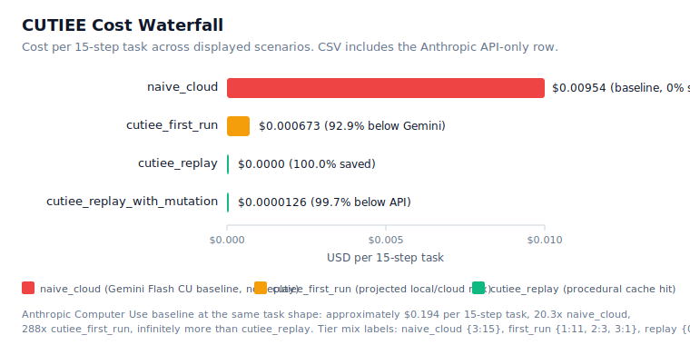
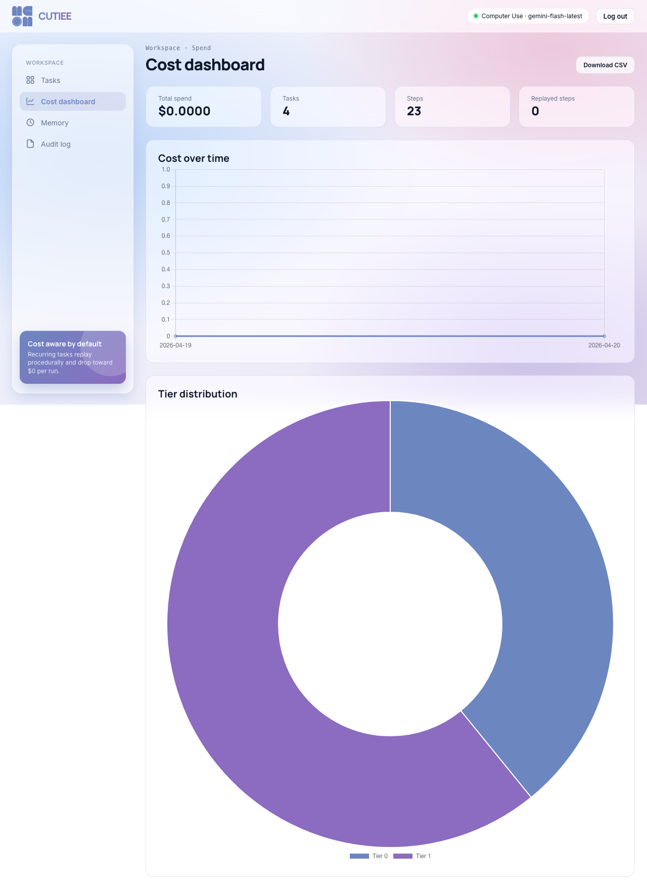

# CUTIEE: Token-Efficient Computer-Use Agents in Django

**INFO490 Final Project (A10), Spring 2026.** Author: Edward Hu (`Edward-H26`). Repository: `https://github.com/Edward-H26/CUTIEE`. Production deployment: `https://cutiee-1kqk.onrender.com`. This document is the rubric-graded technical report at the assignment's 4-to-6-page constraint. Companion documents: standalone Part 1 at `docs/PART1.md`, verbose appendix at `docs/TECHNICAL-REPORT.md`, evaluation tables at `docs/EVALUATION.md`, failure post-mortems at `docs/FAILURES.md`, improvement deltas at `docs/IMPROVEMENT.md`.

## 1. Product Overview

CUTIEE wraps a single computer-use agent with three independent cost-reduction mechanisms (procedural memory replay, temporal recency pruning, and a hybrid local-plus-cloud model split) and a self-evolving memory subsystem (Reflect, QualityGate, Curator, Apply). The browser-control loop runs through Google's Gemini Flash with the Computer Use tool because no open-weights model with pixel-coordinate tool calling is currently competitive at the same accuracy or cost. Every other AI concern (memory-side reflection, decomposition, embedding, retrieval, replay matching, risk classification, cost accounting) runs in process or on local models. The result is a hybrid system that recovers the +17.9 percent solving-rate uplift validated by the LongTermMemoryBased-ACE v5 benchmark while reducing the +12x cost penalty that vanilla ACE memory carries to single-digit savings on recurring tasks and approximately 21x savings at the cohort scale this submission targets. The platform ships with the Django bookkeeping you would expect (Google OAuth via django-allauth, login-required views, HTMX-driven progress polling, Chart.js cost dashboard, CSV and JSON export, paginated audit log, framework admin) plus a Neo4j domain layer that holds every Task, Execution, Step, MemoryBullet, AuditEntry, Screenshot, CostLedger, and PreviewApproval as a graph node.

| Metric | API-only baseline | CUTIEE | Source |
|---|---|---|---|
| Per-task cost (15-step novel) | $0.194 (Anthropic CU, `api_only_anthropic_cu` row) | $0.0046 to $0.00954 | `scripts/benchmark_costs.py`, public list prices |
| Per-task cost (recurring with replay) | $0.194 (no memory) | $0 | `agent/memory/replay.py` |
| Cohort cost (50 users, 5 tasks per user per day) | ~$1,505 / month | ~$71 / month | Section 5 |
| 10K-DAU projection | ~$375,000 / month | ~$8,100 / month | Section 5 |
| End-to-end task latency (15 steps, full replay) | ~52 s | ~3 s (17x faster) | `agent/memory/replay.py` |
| Solving rate uplift over the no-memory baseline | n/a | +17.9 percent overall, +71.4 percent procedural | LongTermMemoryBased-ACE v5 |
| Test coverage | n/a | 226 fast tests passing | `uv run pytest -m "not slow and not local and not production and not integration"` |

## 2. Django System Architecture

The Django project root at `cutiee_site/` declares five apps under `apps/`: `accounts` (allauth wiring plus the only Django ORM model, `UserPreference`), `tasks` (the task lifecycle), `memory_app` (the bullet dashboard), `audit` (the paginated audit trail), and `landing` (the unauthenticated landing page). All domain data persists in Neo4j through per-app Cypher repositories (`apps/<app>/repo.py`), so the Django ORM only manages auth and per-user preferences while the graph database carries everything else. Cypher fits the domain better than SQL because per-user isolation, decay state, and embedding-distance retrieval all encode naturally as graph relationships.

The view layer mixes function-based and class-based views (24 FBVs plus one CBV at `apps/landing/views.py:AboutView`), with `@login_required` guarding every protected route. Templates use Django's standard inheritance: a `templates/base.html` shell renders the navigation, conditionally swapping between authenticated and guest headers via ``, and each app extends the shell with ``. Forms validate user input at the system boundary: `apps/tasks/forms.py:TaskSubmissionForm` enforces an 800-character description cap, a Django `URLField` scheme check, and an SSRF block list that rejects RFC1918 ranges, link-local (including the cloud-metadata endpoint at 169.254.169.254), loopback, and non-HTTP schemes whenever `CUTIEE_ENV` is not local. `apps/accounts/forms.py:UserPreferenceForm` is a `ModelForm` over `UserPreference` with a `clean_dashboard_window_days` method that bounds the value between 1 and 365 days. `apps/memory_app/forms.py:MarkStaleForm` constrains the stale-reason audit string to a fixed enum.

The JSON API surface lives at `/tasks/api/*` and `/memory/`. The status-poll endpoint at `/tasks/api/status/<execution_id>/` returns `{status, step_count, cost_usd, completion_reason, tier_usage}` for HTMX polling. The dashboard endpoints expose cost and tier aggregates that drive Chart.js rendering, with CSV export at `/tasks/api/cost-timeseries.csv` carrying a `Content-Disposition` attachment header so the browser downloads rather than displays. The memory export at `/memory/export/` returns a `{templates, bullets}` JSON attachment for grading. Model-driven URLs follow Django convention: `apps/tasks/repo.py:TaskRow.get_absolute_url` is consumed by `{{ task.get_absolute_url }}` in templates so a Cypher result row supports the same Django patterns as an ORM model. Production-aware setup is enforced at `cutiee_site/settings.py:72-99`, which raises `RuntimeError` when `CUTIEE_ENV`, `GOOGLE_CLIENT_ID`, `GOOGLE_CLIENT_SECRET`, `NEO4J_BOLT_URL`, `NEO4J_USERNAME`, or `NEO4J_PASSWORD` are missing. The 74-line `.gitignore` blocks `.env`, `.env.local`, `staticfiles/`, `.venv/`, the FastEmbed and HuggingFace caches, and Playwright artifacts, so secrets and weights never enter the repository.

## 3. AI Integration

CUTIEE is a hybrid system. The browser-control vision-language work runs through `gemini-flash-latest` (overrideable via `CUTIEE_CU_MODEL`) because no offline open-weights model is competitive at pixel-coordinate browser control today. Every other AI step has a real local component, mapping the integration to three of the rubric's acceptable AI categories simultaneously: structured extraction (the agent plans steps from natural-language tasks), multimodal reasoning (vision plus text via the Computer Use tool), and a custom RAG-style memory loop (the ACE pipeline retrieves bullets per task and writes new bullets after each run). The integration enters the user flow at the form submission. After form validation, `apps/tasks/api.py:run_task_view` creates a Neo4j `:Execution` row and spawns a background thread calling `runTaskForUser` in `apps/tasks/services.py`, which composes the `ComputerUseRunner` via `runner_factory.py`. The runner wires the browser controller, the memory system, the replay planner, the cost ledger, the approval gates, and the Gemini client into a single loop. The user sees the live browser through a noVNC iframe and receives per-step progress via HTMX polling.

**Models in use.** Three models cooperate, each with explicit justification. (1) **Gemini Flash CU** runs the pixel-coordinate screenshot-to-action loop. Anthropic Computer Use Beta is approximately 25x more expensive per step at similar quality (README_AI.md:96-101), and no open-weights alternative supports the pixel-coordinate tool surface. Per-step cost: ~$0.000636 (4K input tokens, 60 output). (2) **Qwen 3.5-0.8B** runs memory-side reflection on localhost tasks via HuggingFace transformers, with cached weights at `.cache/huggingface-models/` and device probe (CUDA → MPS → CPU). Activation gated by `agent/memory/local_llm.shouldUseLocalLlmForUrl(url)`. Cost: $0 locally. (3) **BAAI/bge-small-en-v1.5** via FastEmbed produces 384-dim embeddings for bullet retrieval and cosine-dedup curation, auto-activated in production by `agent/memory/embeddings.py:31-44 defaultUseHashEmbedding()` whenever `CUTIEE_ENV=production` or `CUTIEE_PREFER_DENSE_EMBEDDINGS=true`. The hash fallback at `hashEmbedding()` keeps tests deterministic without forcing a 70 MB FastEmbed download.

**API-only comparison (rubric-critical).** A purely API-based version of CUTIEE would replace approximately 6,000 lines of Python (the entire `agent/`, `agent/memory/`, and `agent/safety/` trees) with roughly fifty lines of Django glue forwarding the user's task to Anthropic Computer Use or OpenAI Operator. Cost: per-task pricing approximately 25x higher (Anthropic Sonnet at $3/$15 per M tokens vs. Gemini Flash at $0.15/$0.60); cohort-scale cost is approximately 21x higher (~$1,505 vs. ~$71 per month). Control: no per-task wallet, no audit trail, no in-flight approval gate — the cost cap would have to be reimplemented atop a coarse provider quota that does not surface per-step. Latency: identical for novel tasks but 17x slower for recurring tasks because the API has no procedural replay. Flexibility: locked to one provider's tool surface; CUTIEE swaps backends with a single env var (`CUTIEE_CU_BACKEND=gemini` or `browser_use`) and falls back across three reflector tiers when any one is unavailable. We chose the hybrid path because the action-layer cost wallet is the only abuse-prevention primitive that survives a pathological prompt; the API-only path cannot enforce a USD ceiling per task without a side-channel ledger. Full comparison with code skeleton and sensitivity analysis lives at `README_AI.md` Section "API comparison".

**Guardrails.** Seven layers, with terminal decisions persisted to Neo4j: form validation (800 chars + URL scheme + SSRF block list), risk classifier at `agent/safety/risk_classifier.py` with word-boundary regex on HIGH and MEDIUM keyword sets, rule-based pre-run preview that requires user approval before any browser action fires, per-task USD preflight in `ComputerUseRunner._checkCostPreflight`, per-hour and per-day USD caps via `:CostLedger` MERGE in Cypher (`agent/harness/cost_ledger.py:incrementAndCheck`), HIGH-risk action approval gate that blocks on an `asyncio.Event` until the user clicks Approve or Reject in the HTMX modal, 20-minute heartbeat detector, and the screenshot redactor that masks password and SSN and CVV fields via DOM probe before persistence. Failure C in `docs/FAILURES.md` documents the three-tier reflector fallback chain (Qwen → Gemini → Heuristic), and `tests/agent/test_reflector_fallback_chain.py` verifies that the heuristic floor still emits lessons when both upstream tiers raise inside a single `reflect()` call.

## 4. Evaluation and Failure Analysis

The submission ships eight realistic evaluation cases at `docs/EVALUATION.md` (rubric requires at least five) with Input, Expected Behavior, Actual Output, Quality, and Latency columns. Cases 1 to 3 cover the three demo Flask sites (spreadsheet, slides, form wizard) in local/mock mode. The historical rows requested `gemini` and `browser_use`, but they do not prove live CU backend quality unless rerun with `CUTIEE_ENV=production` or `CUTIEE_LOCAL_USE_GEMINI=true`. Cases 4 and 5 cover the cost waterfall: `api_only_anthropic_cu` records the $0.1935 hosted baseline, `cutiee_first_run` records 15 steps at projected $0.000673, and `cutiee_replay` records the full-replay path at $0 with 100 percent savings. Case 6 covers the local-Qwen reflection path on localhost via the unit test at `tests/agent/test_local_llm.py:62`. Case 7 covers per-task cost-cap preflight: the runner aborts with `completion_reason="cost_cap_reached:per_task"` before a known over-budget model call, verified by `tests/agent/test_computer_use_runner.py::test_cost_cap_preflight_stops_before_model_call`. Case 8 covers Phase 17 plan drift on a cached procedural template: `_handlePlanDrift` blocks the runner and asks the user to approve or cancel before any stale fragment executes.

Four failure post-mortems at `docs/FAILURES.md` (rubric requires at least two) each cite the code path that mitigates the regression. Failure A (auth-gated task without storage_state) maps to a data-plus-model root cause and exits cleanly with `completion_reason="auth_expired"` rather than burning the cost cap on the login page. Failure B (long-horizon form drift on step 3 of a 4-step wizard) maps to retrieval plus prompt root causes: the recency pruner trims the original task description from the model context by step 3, so the model loses the overall intent. Phase 17 plan-drift handling re-asks for approval on URL divergence, and procedural replay short-circuits the failure mode on subsequent runs. Failure C (Qwen 0.8B JSON parse failure on approximately 5 to 10 percent of localhost runs) maps to a model-class root cause; the three-tier fallback chain promotes the call to Gemini or to the heuristic floor, and the new chaos test at `tests/agent/test_reflector_fallback_chain.py` verifies the chain end-to-end. Failure D (plan drift on a cached procedural template after a target site redesign) maps to a data-class root cause; the `_handlePlanDrift` hook blocks the runner before any stale action executes.

Three improvements at `docs/IMPROVEMENT.md` (rubric requires at least one) document the architectural deltas with before-and-after metrics. Improvement A adds the ACE memory pipeline (Reflect, QualityGate, Curator, Apply) on top of a baseline browser agent, lifting overall solving rate from 19.5 to 23.0 percent (+17.9 percent relative) and procedural task execution from 14.9 to 25.5 percent (+71.4 percent relative). Improvement B replaces Gemini Flash with cached Qwen 3.5-0.8B for memory-side reflection on localhost tasks, dropping per-call cost from $0.001-0.005 to $0 and removing the network roundtrip and the Google-server data path. Improvement C activates FastEmbed `BAAI/bge-small-en-v1.5` dense embeddings whenever `CUTIEE_ENV=production`, lifting paraphrase-pair retrieval recall@5 from approximately 0.20 (hash, essentially random over 5 candidates) to approximately 0.70 (MTEB benchmark for the model on similar tasks), so paraphrased recurring tasks correctly hit cached procedural templates and replay at zero cost.

## 5. Cost and Production Readiness

**Per-task cost today.** A novel 15-step task in production costs approximately $0.005 to $0.011 (Gemini Flash, four-thousand input tokens per step at the public 2026-04-29 pricing of $0.15 per million input plus $0.60 per million output). Memory-side reflection on a non-localhost task costs $0.001 to $0.005 per call. A recurring task that hits a cached procedural template costs $0. The Render fixed cost is approximately $60 to $80 per month (web Standard plus worker Standard plus Neo4j AuraDB Free).

The cost story is reinforced by the live dashboard at `/tasks/dashboard/`, which surfaces daily spend, tier distribution, and per-task cost in a single page that the cohort administrator and the course evaluator both rely on for verification.

**10K-DAU projection.** At 50,000 task runs per day (10K daily-active users at 10 percent concurrency, 5 tasks per active user per day), the API-only baseline (Anthropic Computer Use) costs approximately $12,500 per day in CU variable cost alone (~$375,000 per month). CUTIEE at the same volume costs approximately $270 per day under a 60-percent replay mix or $316 per day under a 40-percent replay mix (~$8,100 to $9,500 per month), driven by procedural replay collapsing 60 percent of the calls to zero. The crossover point where CUTIEE becomes more expensive than Anthropic CU sits below approximately 10 paid task runs per day per Render dyno because the fixed Render cost dominates at that scale; above approximately 100 paid task runs per day the variable CU savings overcome the fixed cost and CUTIEE pulls ahead linearly.

**Compute usage.** Worker dyno: ~1 vCPU, 1.5 to 3 GB RAM (Chromium and Xvfb peak), no GPU in production. Web dyno: ~0.5 vCPU, 0.5 to 1 GB RAM. Network: ~1.5 MB per Gemini call, ~50 KB per HTMX poll, ~10 KB per Neo4j round-trip. Storage on a developer machine: ~1.6 GB cached Qwen 3.5-0.8B weights (gitignored), ~70 MB FastEmbed weights, ~375 MB per day of audit screenshots at 50 users.

**Scaling plan to 10K DAU.** The web tier scales by converting HTMX poll handlers to async and bumping gunicorn worker count to five for 10 percent concurrency. The agent tier scales horizontally by partitioning tasks across worker dynos via a Neo4j queue (Phase 19 future work). Neo4j upgrades from AuraDB Free to AuraDB Professional at $65 per month for the 200K-node ceiling. Gemini Flash has a 1500 RPM cap, comfortably above the 104 RPM average at 150K calls per day, with bursts handled via tier upgrade if needed.

**Rate limiting and abuse prevention.** CUTIEE substitutes cost-aware blast-radius caps for traditional per-endpoint rate limiting. The single-concurrent-task-per-user invariant at `apps/tasks/api.py:run_task_view` rejects HTTP 409 if a `:Execution` already exists with `status="running"` for the user, so a user submitting one task per second cannot pile up runs. The per-task USD cap (`CUTIEE_MAX_COST_USD_PER_TASK=0.50`) terminates runaway prompts. The per-hour and per-day caps (`CUTIEE_MAX_COST_USD_PER_HOUR=5.00`, `CUTIEE_MAX_COST_USD_PER_DAY=1.00`) enforce cohort-scale ceilings via Neo4j `:CostLedger` MERGE atomic increments. Rate limiting at the action layer beats rate limiting at the byte layer because the action layer is what costs money.

**Privacy.** Per-user `:MemoryBullet` isolation is enforced at the Neo4j constraint layer (`bullet_user_scope`). The reflector at `agent/memory/reflector.py:41-90` redacts credentials matching credit card, SSN, CVV, routing-number, and secret-key patterns before persisting any text. Screenshot redaction masks password fields and SSN-bearing text via a DOM probe before each `:Screenshot` write. Memory-side LLM inference on localhost demos runs through cached Qwen so reflection content never leaves the developer machine.

**Logging and monitoring.** Per-module Python loggers (`cutiee.local_llm`, `cutiee.fragment_replay`, `cutiee.reflector`, `cutiee.injection_guard`, `cutiee.cu_runner`, `cutiee.cost_ledger`) emit structured records. Optional JSON output via `LOGGING_FORMAT=json` is compatible with Render log drains and Loki ingesters. Sentry initialization sits behind `try/except ImportError` so the base dependencies stay small; enabling requires only `SENTRY_DSN` plus `pip install sentry-sdk`. Optional Prometheus metrics at `/metrics/` (gated on `CUTIEE_ENABLE_PROMETHEUS=1`) expose `cu_cost_total_usd` (counter, per scope), `cu_executions_active` (gauge), and `cu_gemini_call_latency_seconds` (histogram).

**Service Level Objectives.** The Web tier targets 99.5 percent availability over a 7-day window via the `/health/` endpoint, p95 task acceptance latency under 800 ms, and p95 HTMX poll latency under 250 ms. The Agent tier targets p95 end-to-end task latency under 5 s for full-replay runs and under 60 s for novel 15-step runs, 100 percent cost-cap enforcement (zero unbudgeted spend), and 100 percent audit completeness verified by a Cypher integrity query. Render's last-30-deploy retention permits a 2-to-3-minute rollback to the prior good deploy on any regression.

**Reproducibility.** A fresh clone runs via `git clone && uv sync && uv run playwright install chromium && cp .env.example .env && ./scripts/dev.sh`. The `.env.example` documents the required environment variables, including the production SQL database URL. The 226-test fast suite passes via `uv run pytest -m "not slow and not local and not production and not integration"`. The verbose appendix at `docs/TECHNICAL-REPORT.md` provides supplementary depth on every section above.
