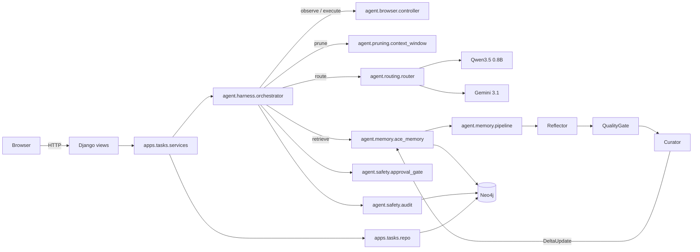

# Part 1 — CUTIEE Product Refinement

## Refined problem statement

Computer-use agents are economically broken. A naive cloud agent that drives a
browser via a frontier vision-language model burns roughly thirty cents per
task, mostly on screenshots that re-encode the same interface dozens of times
per workflow. Pricing dictates product strategy: either the user pays a usage
fee that hides the per-task cost, or the agent gets restricted to a handful of
prepaid runs per month. Neither posture supports the obvious consumer
behaviour, which is to delegate the same recurring chores week after week.

CUTIEE refuses both compromises. The system runs a learning loop on top of any
underlying computer-use model and drives the per-task cost toward zero for
recurring work. Three engineered mechanisms compound: procedural memory replay
turns successful workflows into deterministic bytecode that needs no model
inference, temporal recency pruning keeps every per-step prompt bounded
regardless of task length, and three-tier model routing sends cheap actions
to a small local model while reserving the expensive frontier model for novel
or high-risk decisions. The fourth, often understated, mechanism is the
self-evolving template: when an interface mutates, the failed step
re-grounds through the router and patches the template so subsequent runs
remain free.

## Target users

The first user is the technically literate consumer who has accumulated a
catalogue of weekly browser chores. Sorting a household budget spreadsheet,
reordering a stand-up slide deck, archiving a sender's email backlog, filling
a recurring multi-step form. CUTIEE turns those chores into delegable units
that the agent gets faster and cheaper at as the user repeats them. The
secondary user is the developer team building computer-use products: CUTIEE
ships as a reusable harness whose three mechanisms drop in around any vision
model, so a startup can stop spending on prompt engineering and start
shipping product.

## Final feature set

- Google OAuth primary login with email-password as a secondary path.
- Task submission, with a starting URL and an optional domain hint.
- Live HTMX progress with per-step tier, model, cost, and verification.
- Procedural memory dashboard listing bullets and templates with a JSON
  export endpoint.
- Cost dashboard with a daily-spend line chart and a tier distribution
  doughnut.
- Audit log with per-step detail (action, target, model, tier, cost, risk,
  approval status).
- Safety approval gate that suspends high-risk actions and waits for the
  user.
- VLM readiness banner that shows whether the local Qwen instance or the
  cloud Gemini endpoint is responding.

## Deprioritised for the INFO490 submission

- Multi-user shared memory; templates are scoped per user.
- A browser extension front-end; the agent runs headless behind Django.
- Voice task entry; text descriptions are sufficient.
- Cross-domain template transfer; templates carry a `domain` tag and are
  matched per host.

## User flow

1. The user signs in with Google. A `:User` node materialises in Neo4j on
   first login.
2. The dashboard renders existing tasks, the cost summary, and the model
   readiness banner.
3. The user submits a new task. The task persists in Neo4j as a `:Task` node
   under the `:User`.
4. The user clicks "Run task now". A background thread spins up the
   orchestrator.
5. The orchestrator first asks the ACE memory pipeline whether a procedural
   bullet cluster matches the task above the threshold. If so, the planner
   reconstructs the action sequence and the browser controller replays it at
   zero inference cost.
6. If no replay path exists, the router classifies difficulty, picks the
   cheapest viable tier, and steps through the observe-reason-act loop.
   The pruner trims the trajectory context before every model call. The
   safety gate suspends any high-risk action until the user approves it via
   the HTMX progress panel.
7. After the run, the ACE pipeline reflects on the trace, the quality gate
   filters lessons, and the curator emits a `DeltaUpdate` that the memory
   layer applies to Neo4j. The audit log persists every step. The cost
   dashboard updates on the next poll.

## System flow diagram

## Acceptance criteria

A submitted task runs end-to-end against the demo Flask sites, the
procedural memory grows after the first successful run, the second run of
the same task replays at zero VLM cost, the cost dashboard reflects the
accumulated spend, and the audit log shows the per-step decisions.
